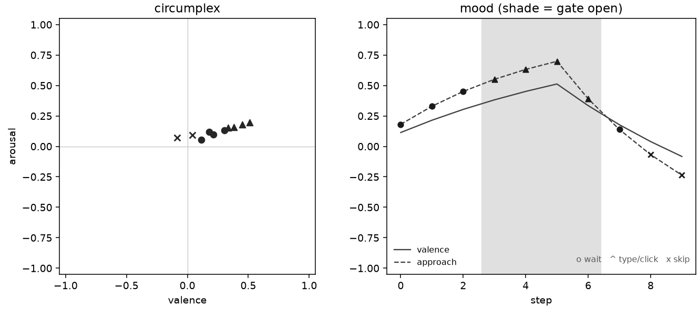

# Affective Fly

Reduced *Drosophila* mushroom-body circuit (Kenyon cells, DANs, MBONs) as the affect source for [emotional-memory](https://github.com/gianlucamazza/emotional-memory). Decisions use approach/avoid rates and a slow mood average, not embedding similarity.

Python 3.11+. Mapping: linear, documented in [`docs/MAPPING_MBON_DAN.md`](docs/MAPPING_MBON_DAN.md). Loop and modules: [`docs/ARCHITECTURE.md`](docs/ARCHITECTURE.md). Backend runtimes: [`docs/BENCHMARKS.md`](docs/BENCHMARKS.md). Open work: [`docs/ROADMAP.md`](docs/ROADMAP.md). Full index: [`docs/README.md`](docs/README.md).

Human-emotion words from `honesty.py` are labels on the circumplex, not claims about fly experience.

## What it does

`affective-fly` turns a stream of host events into an **affective state** — valence, arousal, and an approach/avoid tendency on Russell's circumplex — and a discrete decision (wait, act, or skip). That state comes from a reduced *Drosophila* mushroom-body circuit (Kenyon cells → dopaminergic DANs → MBON output neurons), not from text embeddings.

It is the *affect source* for [emotional-memory](https://github.com/gianlucamazza/emotional-memory): the current affect is written onto encoded memories, and retrieved memories feed back into the next decision. Where a similarity-only memory reacts to *what* an event resembles, this reacts to *how the accumulated experience feels* — a slow mood (`MoodField`, τ in seconds) that carries across ticks and across processes.

## How it works

Each tick (`AffectiveLoop.step`; full flow in [`docs/ARCHITECTURE.md`](docs/ARCHITECTURE.md)):

```
SensoryFrame → fly circuit (KC→DAN→MBON) → CoreAffect (valence/arousal + approach)
            → MoodField (slow EMA) → Policy + LaunchGate → Decision
```

- **Encode**: the current affect is attached to the memory via `EmotionalMemory.set_affect` / `encode`.
- **Retrieve**: past memories are recalled and can veto a decision (strongly negative recalled valence → SKIP).
- **Learn**: a reported reward/outcome triggers three-factor plasticity on KC→MBON weights (PAM if positive, PPL1 if negative).

The circumplex/mood readout of a demo episode is shown under [Usage](#usage).

## Objectives

- Provide a stable, interpretable valence/arousal signal as input to `emotional-memory`.
- Keep a documented, calibrated mapping from spiking rates to the MBON/DAN bands ([`docs/MAPPING_MBON_DAN.md`](docs/MAPPING_MBON_DAN.md)), so real circuits — not only `MockFlyCircuit` — drive Policy and LaunchGate.
- Support three-factor learning and versioned host integration (`HostFrame`, journal replay).
- Stay honest and reproducible: `ruff`/`mypy` clean, tests green, benchmarks committed, and no claim beyond what the code does (without a real connectome the KC→MBON weights are random, and the code says so).

## Not in scope

Token-launch product, sex/mating ensembles, and swarms of N ≫ 8 (see [`docs/ROADMAP.md`](docs/ROADMAP.md)). Brian2 C++ standalone codegen is opt-in (`Brian2Circuit(codegen_target="cpp_standalone")`); the default remains numpy so CI needs no compiler.

## Installation

```bash
git clone https://github.com/gianlucamazza/affective-fly.git
cd affective-fly
git checkout v0.2.5
uv sync --extra dev --extra brian --extra viz
```

`numpy` is pinned below 2.x so Brian2 2.9 imports on 3.11. Extra `embed` (sentence-transformers) is optional; MiniLM is not loaded by `make demo`. Equivalent: `pip install -e ".[dev,brian,viz]"`.

## Usage

```bash
make demo    # writes demo_loop.png (circumplex + mood/gate; needs viz extra)
make test
python -m affective_fly version
python -m affective_fly demo persist
python -m affective_fly run --interval 2    # lab ticks (8/4/5, mood_dt=1.0); Ctrl-C to stop
python -m affective_fly study --replay host_journal.jsonl  # hypothesis 300/60/180 + wall-clock mood_dt
python -m affective_fly calibrate measure.jsonl  # L3 summary; no invented fits
make benchmark    # LIF vs Brian2 ms/step sweep (docs/BENCHMARKS.md)
make figures      # regenerate docs/figures/ (needs viz extra)
```

`python -m affective_fly run` uses lab mood taus (8 / 4 / 5 s) so valence moves in seconds and writes `measure.jsonl` with `mood_dt=1.0`. `python -m affective_fly study` uses `MoodField()` defaults (300 / 60 / 180 s) and wall-clock `mood_dt`. Those taus stay unvalidated hypotheses until a real host session — see [`docs/ARCHITECTURE.md`](docs/ARCHITECTURE.md) and [`docs/PHASE6_MEASUREMENT.md`](docs/PHASE6_MEASUREMENT.md).

A demo episode: sustained approach opens the launch gate (shaded), then failed reviews pull valence down and memory-driven avoidance yields SKIP. Regenerate with `make figures`.



### Recommended: HostFrame Integration

Use `HostFrame` for structured host integration with versioned schema and journal replay (see [`docs/HOST_INTEGRATION.md`](docs/HOST_INTEGRATION.md)):

```python
from emotional_memory import EmotionalMemory, InMemoryStore
from affective_fly import AffectiveLoop, FakeEmbedder, LIFCircuit, HostFrame

store = InMemoryStore()
embedder = FakeEmbedder()
loop = AffectiveLoop(
    fly_circuit=LIFCircuit(n_kc=1000, n_dan=20, n_mbon=34, seed=42),
    emotional_memory=EmotionalMemory(store=store, embedder=embedder),
    store=store,
    embedder=embedder,
)

# Create a HostFrame from semantic events
frame = HostFrame(context={
    "context": "journal",
    "note_id": "debugging-session-001",
    "sentiment": 0.8,
    "query": "successful debugging session notes",
})

decision = loop.step(frame.to_sensory_frame(), encode_memory=True)

# Report outcome for three-factor learning
outcome_frame = HostFrame(context={
    "context": "journal",
    "note_id": "debugging-session-001",
    "sentiment": -0.6,
    "reward": -0.8,  # Triggers KC→MBON plasticity
})

decision = loop.step(outcome_frame.to_sensory_frame())
print(decision.action, decision.mood_valence, decision.reason)
```

### Alternative: Direct SensoryFrame (still supported)

Direct `SensoryFrame.from_dict()` usage remains supported:

```python
from affective_fly import AffectiveLoop, FakeEmbedder, MockFlyCircuit, SensoryFrame

store = InMemoryStore()
embedder = FakeEmbedder()
loop = AffectiveLoop(
    fly_circuit=MockFlyCircuit(seed=42),
    emotional_memory=EmotionalMemory(store=store, embedder=embedder),
    store=store,
    embedder=embedder,
)

decision = loop.step(
    SensoryFrame.from_dict({
        "context": "journal",
        "note_id": "debugging-session-001",
        "sentiment": 0.8,
    }),
    encode_memory=True,
)
```

`sentiment` is added to the sensory vector. `reward`, `outcome`, or `pnl` call `learn()` (PAM if positive, PPL1 if negative).

To persist across processes, pass `SQLiteStore("affective_fly.db")` and `save_mood` / `load_mood` on the same file (`examples/demo_persist.py`). Swap `FakeEmbedder` for `SentenceTransformerEmbedder` (`uv sync --extra embed`; downloads a model). See `examples/demo_embedder.py`.

## License

MIT. See [LICENSE](LICENSE).

## References

- Aso, Y. et al. (2014). *eLife* 3:e04577.
- Russell, J. A. (1980). *J. Pers. Soc. Psychol.* 39(6), 1161–1178.
- Mazza, G. (2026). *emotional-memory: Affective Field Theory for LLM Memory*. https://doi.org/10.5281/zenodo.21870707
