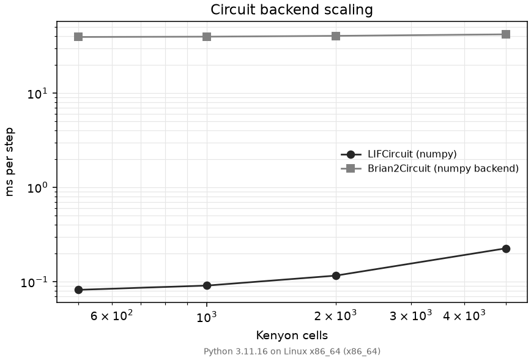

# Benchmarks

Per-step runtime of the two spiking circuit backends across Kenyon-cell population
size. Source: [`examples/benchmark_brian2_codegen.py`](../examples/benchmark_brian2_codegen.py).
Methodology: [ROADMAP.md](ROADMAP.md), Phase 5 (`cpp_standalone` opt-in).

## What is measured

`LIFCircuit` (pure Python/numpy) and `Brian2Circuit` (Brian2 numpy backend, the default
`codegen_target`) are each driven with a fresh 64-dim Gaussian sensory vector per step at
`dt = 1 ms`, `n_dan = 20`, `n_mbon = 34`, seed 42. Five warm-up steps precede each
measurement; the reported value is wall time over 50 steps divided by the step count. Only
`step()` cost is timed — construction and the first-step C++ compile on
`codegen_target="cpp_standalone"` are excluded from the loop. Pass `--cpp` to measure the
standalone path after that compile (skipped cleanly without a C++ toolchain).

This is the circuit inner loop, not a full `AffectiveLoop` tick (which also runs the bridge,
mood EMA, memory encode/retrieve, policy, and gate). It isolates the backend so scaling in
`n_kc` is visible.

## Reference results

Measured in this repository's dev environment (single run; sub-millisecond LIF times are
noisy, so treat one significant figure as meaningful). Numbers are hardware-dependent —
regenerate locally with `make benchmark`.

Python 3.11.16 on Linux x86_64.

| KC | LIFCircuit (ms/step) | Brian2Circuit (ms/step) | Brian2 / LIF |
|---:|---:|---:|---:|
| 500 | 0.082 | 39.324 | 481.64x |
| 1000 | 0.091 | 39.634 | 433.94x |
| 2000 | 0.116 | 40.424 | 347.61x |
| 5000 | 0.226 | 41.947 | 185.34x |



## Reading the numbers

- `LIFCircuit` runs in well under 1 ms/step across the whole range and grows sub-linearly
  with `n_kc` over 500–5000 (roughly 0.08 → 0.23 ms/step, under 3x for a 10x population). It is
  the default backend for live runs.
- `Brian2Circuit` is dominated by a fixed per-step overhead of ~40 ms on the numpy backend;
  that overhead barely moves with `n_kc` over this range, so the LIF/Brian2 ratio narrows as
  the population grows but Brian2 stays two-to-three orders of magnitude slower.
- The overhead is the numpy code-generation runtime, not the neuron count. Phase 5 adds
  `codegen_target="cpp_standalone"` to close that overhead after a cached build. Latency
  budget: after the first compile, a 2000-KC `step()` should sit inside the 50 ms simulated
  tick. First compile is outside the budget. At these sizes `LIFCircuit` already keeps a
  full loop tick well inside interactive latency, so Brian2 remains a
  correctness/validation backend unless a host opts into C++.

## Reproduce

```bash
uv sync --extra dev --extra brian --extra viz
make benchmark                 # sweep 500/1000/2000/5000 KC, prints table
# or customise:
uv run python examples/benchmark_brian2_codegen.py --kc 500 1000 --steps 30
uv run python examples/benchmark_brian2_codegen.py --kc 2000 --steps 20 --cpp  # needs g++
```

`make benchmark` writes `docs/benchmark_results.txt` and `docs/benchmark_results.json`
(both local, git-ignored). Without the `brian` extra the script measures `LIFCircuit`
only and marks Brian2 as not installed. The scaling figure above is regenerated by
`make figures` (see [figures/README.md](figures/README.md)).
